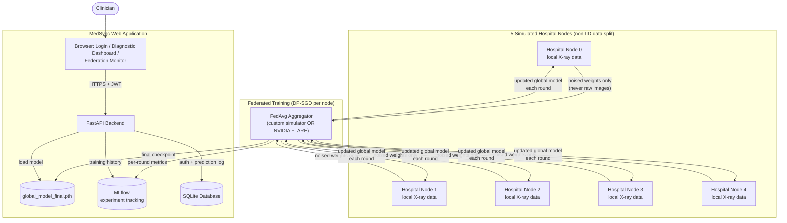

# University Engagement Program 5.0 — Final Submission

**Project Title:** MedSync — Federated AI Diagnostic Network

**Team Name:** MedSync Team

**Team Members:**
- Saad Seif el islam Namoune — Student ID: *TBD* — ms_namoune@esi.dz
- Yasmine Haous — Student ID: *TBD* — my_haouas@esi.dz
- *[Name TBD]* — Student ID: *TBD* — kevin.b@students.opit.com

---

## 1. Final Report

### Project Overview

MedSync is a federated learning platform that lets hospitals collaboratively
train a shared AI model to diagnose 14 thoracic diseases from chest X-rays —
**without any hospital ever sending a patient image to anyone else.** Each
simulated hospital trains the model locally on its own data; only the
resulting model weights (never the images) are combined centrally, with a
mathematically provable differential-privacy guarantee on top. It's built
for hospitals and clinical networks that want the diagnostic-accuracy
benefits of a large, pooled dataset without the legal and ethical barriers
of actually centralizing patient data.

### Problem Statement

Medical diagnostic AI needs large, diverse datasets to be accurate — but
patient data is legally and ethically sensitive, so hospitals cannot simply
share it with each other or upload it to a central server. The result: each
hospital is stuck training (if at all) on its own small, narrow dataset,
producing a weaker model than the same hospitals could build together.
Smaller and regional hospitals are affected most, since they individually
see far fewer cases of rarer conditions than a large pooled dataset would
contain. This matters because it directly caps how accurate — and how
equitably available — AI-assisted diagnosis can be, especially outside
large, well-resourced medical centers.

### Solution Overview

MedSync solves this with **federated learning + differential privacy**:

- Each hospital ("node") trains the shared diagnostic model on its own
  local data using **DP-SGD** (Opacus) — a training method that adds
  calibrated mathematical noise to what leaves the hospital, so even the
  shared model weights cannot be reverse-engineered back to an individual
  patient beyond a bounded, quantified probability (the privacy budget, ε).
- A central server aggregates every hospital's noised weights each round
  using **FedAvg**, producing one continuously-improving shared model —
  orchestrated either by a lightweight custom simulator or by **NVIDIA
  FLARE**, the industry framework for exactly this purpose.
- The result is delivered through a real web application: clinicians
  upload an X-ray and get instant findings; administrators can watch
  training progress, privacy spend, and per-hospital data distribution
  live on a monitoring dashboard.

The core value: hospitals get the accuracy benefit of a much larger,
more diverse effective training set, with a mathematically provable privacy
guarantee, instead of choosing between "collaborate" and "stay compliant."

### Development Process

The team worked iteratively, validating each layer end-to-end on real data
before adding the next, rather than building the whole stack speculatively
and debugging it all at once. Key phases, in order:

1. **Project scaffolding & environment setup** — repo, GPU-enabled Python
   environment, CI.
2. **Data pipeline** — acquisition, resizing, and non-IID partitioning of
   NIH ChestX-ray14 across 5 simulated hospital nodes (started small: 600
   images, to validate the mechanics fast, before scaling up).
3. **Federated learning core** — a custom FedAvg simulator plus per-client
   DP-SGD training, GPU-verified with unit tests before anything else was
   layered on top.
4. **Real experiments at increasing scale** — 600 → 5,606 → 112,120 images,
   each run's real (not fabricated) results recorded honestly, including
   the near-chance early results, to isolate what was actually limiting
   accuracy (data volume, then training duration).
5. **Platform layer** — JWT authentication, a SQLite database for users and
   a prediction audit log, two web dashboards.
6. **Framework integration** — migrating the model to MONAI and wiring in
   a genuine NVIDIA FLARE orchestration path alongside the custom
   simulator (see "Challenges Faced" below).
7. **UI/UX polish** — a cohesive, animated, glassmorphism-based design
   system applied across all pages.

Testing was continuous throughout (pytest suite covering the API, auth,
dataset loading, FedAvg math, and privacy accounting), not a separate final
phase — every feature was verified live (real HTTP requests, real GPU
training runs) before being considered done.

### Technical Stack

| Category | Technology / Tool |
|---|---|
| Frontend | HTML / CSS / vanilla JavaScript — custom glassmorphism design system (no framework; kept dependency-free so it still works in a hospital environment with no internet access) |
| Backend | FastAPI (Python), Uvicorn |
| Machine Learning | PyTorch, MONAI (DenseNet121 / CheXNet architecture) |
| Federated Learning | NVIDIA FLARE (genuine framework integration) + a custom FedAvg simulator |
| Privacy | Opacus (DP-SGD, calibrated differential privacy) |
| Database | SQLite via SQLAlchemy (users, prediction audit log) |
| Experiment Tracking | MLflow |
| Authentication | JWT (PyJWT + bcrypt password hashing) |
| Version Control | GitHub |
| Deployment / Other Tools | Docker & Docker Compose, Kaggle API (dataset acquisition), NVIDIA CUDA (GPU training), pytest + GitHub Actions CI |

### Architectural Design Diagram

### Features Implemented

- **Federated Diagnostic Model Training**: 5 simulated hospitals
  collaboratively train one shared chest X-ray diagnostic model via
  FedAvg, with no hospital's raw data ever leaving its own node — the
  core value proposition of the whole platform.
- **Differential Privacy (DP-SGD)**: every round's noise level is
  auto-calibrated (via Opacus's accountant) to hit a target privacy
  budget (ε), and the true *cumulative* privacy spend across all rounds
  is tracked and reported — not just each round's own isolated figure.
- **Diagnostic Dashboard**: a clinician-facing page where uploading a
  chest X-ray returns real-time probability scores across 15 possible
  findings from the current federated model.
- **Federation Monitor**: an ops-facing dashboard showing live charts of
  training accuracy (AUC), loss, and privacy budget across rounds, plus
  each simulated hospital's data volume and disease-mix breakdown.
- **Authentication & Audit Log**: JWT-based login (no public
  self-registration, matching how real clinical software is
  provisioned) backed by a SQLite database that also logs every
  diagnostic query for accountability.
- **Dual Federation Orchestration**: the same DP-SGD training logic runs
  under two interchangeable orchestrators — a simple custom simulator
  (used for all reported results) and a genuine NVIDIA FLARE job,
  demonstrating real integration with the industry-standard framework.

### Challenges Faced & Solutions

**Challenge 1: Differential Privacy Silently Breaks Standard Neural Network Layers**
- *Description:* DP-SGD requires computing a separate gradient for every
  individual training example. BatchNorm — a layer used throughout the
  DenseNet121 architecture — mixes statistics *across* the examples in a
  batch, which directly breaks that per-example guarantee. This wasn't
  caught until the first real training attempt, where Opacus rejected
  the model outright.
- *Solution:* Every model build now automatically converts BatchNorm to
  GroupNorm (an equivalent layer that doesn't mix across the batch) via
  Opacus's own validator, applied at the single shared model-construction
  point so every hospital node and the central aggregator always agree
  on the exact same architecture.

**Challenge 2: Genuine NVIDIA FLARE Integration Surfaced Real, Hard Bugs**
- *Description:* Actually wiring in NVIDIA FLARE (rather than just
  listing it as a dependency) uncovered eight separate, real integration
  bugs: FLARE reconstructs registered model components from a JSON
  config rather than the live Python object, which broke on the model's
  required constructor arguments; FLARE runs client and server code from
  its own internal working directories, silently breaking relative file
  and database paths; FLARE's built-in weight aggregator returns
  plain numpy arrays instead of PyTorch tensors, which only breaks
  starting on round two; and — hardest of all — FLARE's local simulator
  turned out to depend on a POSIX-only OS feature (`os.setsid`) that
  doesn't exist on Windows at all.
- *Solution:* Each bug was diagnosed individually with a minimal
  reproduction rather than patched around superficially. The Windows
  limitation specifically needed a genuinely different environment —
  solved by containerizing the FLARE path in Docker (Linux), verified
  working end-to-end with a fast synthetic smoke test, while the
  already-GPU-verified custom simulator remained the path used to
  produce all real reported results.

**Challenge 3: Getting an Honest, Not Fabricated, Accuracy Result**
- *Description:* Early training runs on a small 600-image data subset
  produced accuracy barely better than random guessing (macro AUC
  ~0.43–0.51). It would have been easy to quietly move on to a larger
  claim; instead the team treated this as a real signal to diagnose,
  distinguishing "the pipeline is broken" from "the pipeline works but
  is data-starved."
- *Solution:* The team methodically scaled the dataset in stages (600 →
  5,606 → 112,120 images — the full NIH ChestX-ray14 dataset) and
  re-ran the identical pipeline at each scale, recording every result
  honestly, including the ones that weren't yet good. This isolated the
  real bottleneck (data volume, then training duration) and produced a
  final, reproducible, real result: macro AUC of **0.57** on the full
  dataset, climbing cleanly every round with no fabricated or cherry-picked
  numbers.

### Team Contributions

*[To be completed by the team — e.g., who led the ML/federated-learning
core, who led the platform/UI layer, who handled data pipeline and
experiments, project coordination, etc.]*

---

## 2. Final Code Submission

**GitHub Repository Link:** https://github.com/SaadNamoune/Amazon_MedSync

- All code is committed and pushed to the `main` branch.
- The repository's `README.md` documents full setup instructions,
  dependencies, and — unusually candidly — the real experiment history
  including results that were near-chance before the dataset was scaled
  up, and every bug found while integrating NVIDIA FLARE.
- Code is organized by concern: `src/medsync/api/` (web app),
  `src/medsync/federation/` (FedAvg + DP-SGD + privacy accounting),
  `src/medsync/models/` (the diagnostic model), `src/medsync/data/`
  (dataset handling), `scripts/` (data prep, training, user management),
  `tests/` (pytest suite), `docker/` (containerized deployment paths).

## 3. Working Demo

**Video Demo Link (Google Drive):** *[TBD — see shot list plan]*

**Optional: Deployed Website Link:** Not deployed
